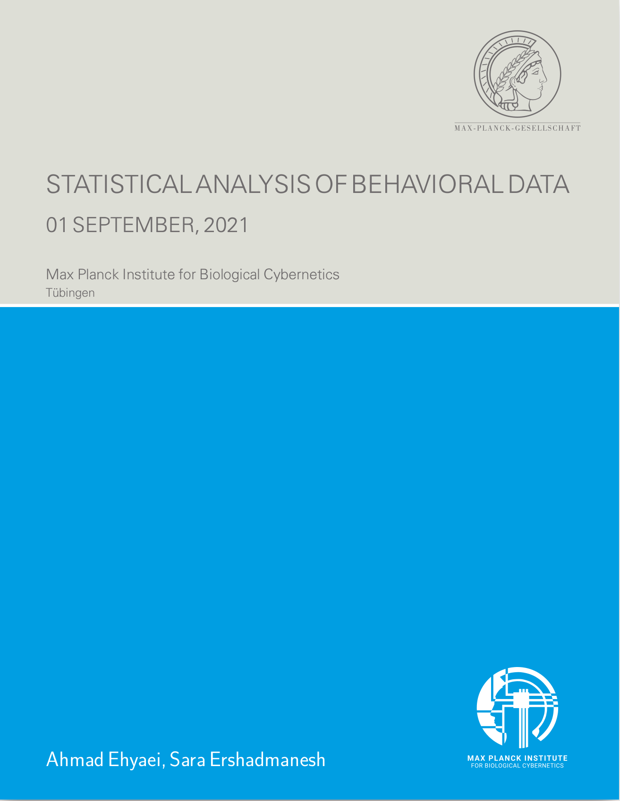
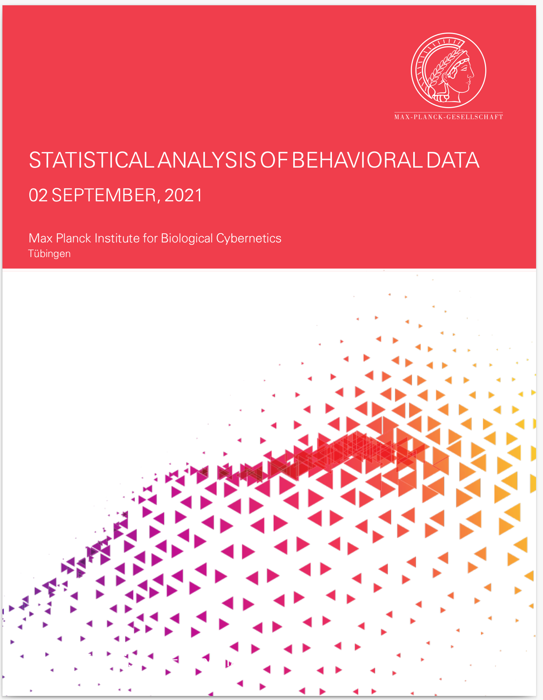

<!-- README.md is generated from README.Rmd. Please edit that file -->

```{r, echo=FALSE, results="hide", message=FALSE, include=FALSE}
knitr::opts_chunk$set(
  collapse = TRUE,
  comment = "#>",
  results="hide",
  eval = FALSE,
  fig.path = "man/figures/README-",
  out.width = "100%"
)
library("badger", quietly = TRUE)
```

# MPIThemes

```{r, echo = FALSE, results='asis', message=FALSE,eval=TRUE}
cat(
  badger::badge_github_actions("Ehyaei/MPIThemes"),
  badger::badge_devel("Ehyaei/MPIThemes", "orange"),
  badger::badge_lifecycle("experimental"),
  badger::badge_last_commit("Ehyaei/MPIThemes")
)
```

<a href={https://github.com/Ehyaei/MPIThemes}>

RMarkdown enables you to write reproducible academic publications such as articles, PhD thesis, lab reports, posters, presentations, and a variety of other fascinating documents using the lightweight and plain-text Markdown syntax.

In the Rmarkdown environment, you can write text, insert images, formulas, R and recently, Python scripts. When running your Rmd files with knitr, output plots, tables and code results are embedded in the md file. Then, Rstudio by using pandoc's powerful engine can convert your documents to many formats, such as PDF, Docx, HTML, epub, and... In particular, you can create PDF reports without worrying about the lateX code.

<p align="center">

<a href="https://epirhandbook.com/reports-with-r-markdown.html">image source</a>
</p>

The MPIThemes package's objective is to provide a wide range of Rmarkdown templates with ggplot themes for scientific reproducible research with custom design for the MAX-PLANCK institute.

For designing report templates, I found the CD manual (available [here](https://docplayer.org/2328711-Max-planck-institut-das-erscheinungsbild-der-max-planck-gesellschaft-4-ueberarbeitete-auflage.html))

<p align="center">

</p>

The manual sets out the standards for writing reports for Max-Planck society. The title page, logo, size, colors, and font guidelines are all described in this document. I attempted to meet the guidelines, but it still does not fully comply.

The reports' default format is based on the Maxi-Planck theme. We weren't, however, constrained by this theme. Reports in various styles can be created by defining the relevant parameters in YAML. for more details see [PDF Report Template Customization]() Some Design can be found in the [examples](https://github.com/Ehyaei/MPIThemes/tree/master/examples) section.

|                                                                     |                                                                                                                                       |                                                                                                                  |
|---------------------------------------------------------------------|---------------------------------------------------------------------------------------------------------------------------------------|------------------------------------------------------------------------------------------------------------------|
|  |  |  |

## Installation

You can install the released version of MPIThemes from [GitHub](https://github.com/) with:

``` r
# install.packages("devtools")
devtools::install_github("Ehyaei/MPIThemes")
```

## Usage

## Example output

## Requirements

## Attribution

## TODO

I'll try to gradually add the following templates into the package. Please let me know if you have a suggested template.

-   [x] PDF Report (LaTeX)
-   [ ] Short PDF note (LaTeX)
-   [ ] Long Document (Gitbook/Bookdown)
-   [ ] Editable Report (Word)
-   [ ] PhD Thesis (LaTeX/Bookdown)
-   [ ] Beamer Presentation (LaTeX)
-   [ ] HTML Presentation (RevealJS)
-   [ ] Editable Presentation (Powerpoint)
-   [ ] Conference Posters (HTML/LaTeX)
