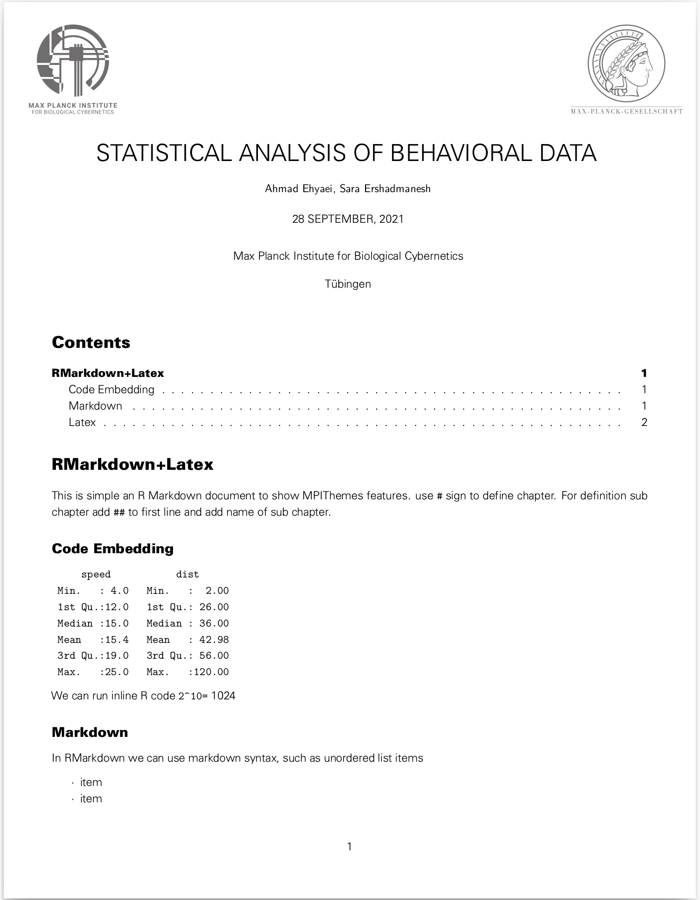
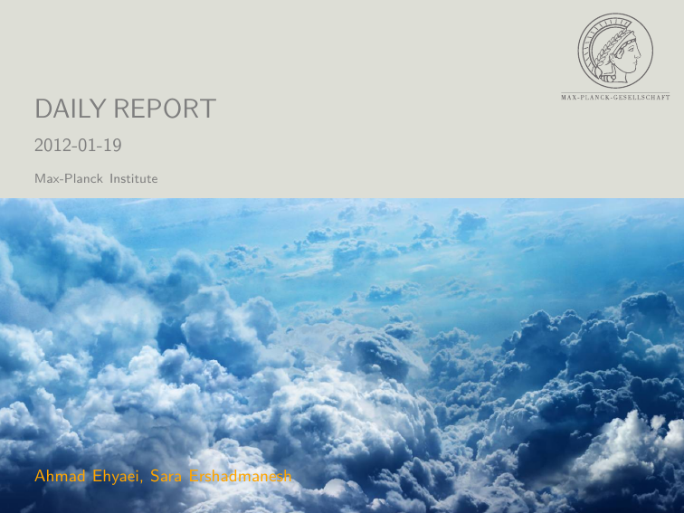
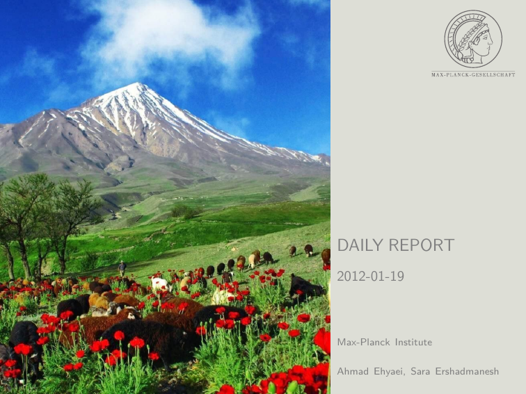
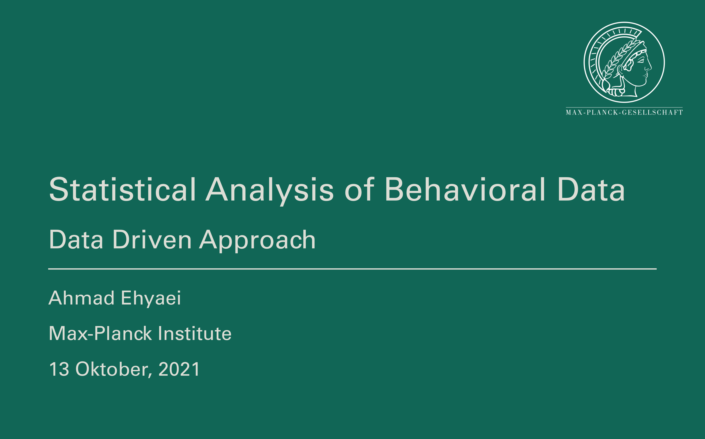
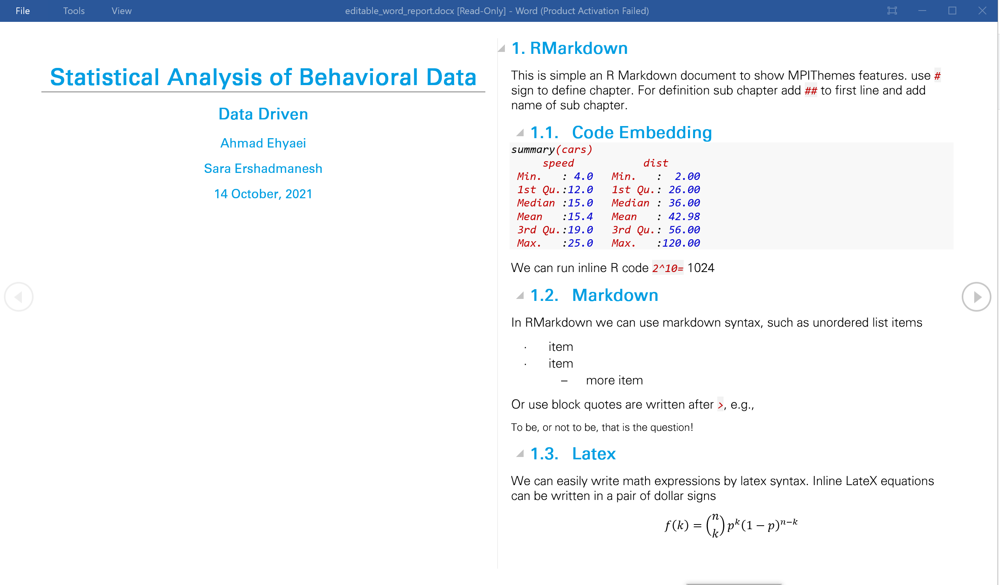

<!-- README.md is generated from README.Rmd. Please edit that file -->

```{r, echo=FALSE, results="hide", message=FALSE, include=FALSE}
knitr::opts_chunk$set(
  collapse = TRUE,
  comment = "#>",
  results="hide",
  eval = FALSE,
  fig.path = "man/figures/README-",
  out.width = "100%"
)
library("badger", quietly = TRUE)
```

<a href={https://github.com/Ehyaei/MPIThemes}>

# MPIThemes 

```{r, echo = FALSE, results='asis', message=FALSE,eval=TRUE}
cat(
  badger::badge_github_actions("Ehyaei/MPIThemes"),
  badger::badge_devel("Ehyaei/MPIThemes", "orange"),
  badger::badge_lifecycle("experimental"),
  badger::badge_last_commit("Ehyaei/MPIThemes")
)
```

RMarkdown enables you to write reproducible academic publications such as articles, PhD thesis, lab reports, posters, presentations, and a variety of other fascinating documents using the lightweight and plain-text Markdown syntax.

In the Rmarkdown environment, you can write text, insert images, formulas and simultaneously R and Python scripts.

> MPIThemes is not only for R users!. Python programmers can also run 
codes in Rmarkdown. This [article](https://ehyaei.github.io/MPIThemes/articles/articles/21_python_rmarkdown.html) has additional information.

When running your Rmd files with knitr, output plots, tables and code results are embedded in the md file. Then, Rstudio by using pandoc's powerful engine can convert your documents to many formats, such as PDF, Docx, HTML, epub, and... In particular, you can create PDF reports without worrying about the lateX code.

<p align="center">

</p>


The MPIThemes package's objective is to provide a wide range of Rmarkdown templates with ggplot themes for scientific reproducible research with custom design for the MAX-PLANCK institute.
For designing report templates, I found the CD manual (available [here](https://docplayer.org/2328711-Max-planck-institut-das-erscheinungsbild-der-max-planck-gesellschaft-4-ueberarbeitete-auflage.html))

<p align="center">

</p>

The manual sets out the standards for writing reports for Max-Planck society. The title page, logo, size, colors, and font guidelines are all described in this document. I attempted to meet the guidelines, but it still does not fully comply.

# Features

The `MPIThemes` package contains report and presentation templates in
PDF, HTML, Office formats. 
In the articles area, you'll find an introduction to each template as well as instructions on how to config it.
The templates that have been implemented so far are as follows:

- [PDF Report (LaTeX)](https://ehyaei.github.io/MPIThemes/articles/articles/01_pdf_report_template_customization.html)
- [Short PDF note (LaTeX)](https://ehyaei.github.io/MPIThemes/articles/articles/02_short_pdf_report.html)
- [Long Document (Gitbook/Bookdown)](https://ehyaei.github.io/MPIThemes/articles/articles/03_bookdown_document.html)
- [Beamer Presentation (LaTeX)](https://ehyaei.github.io/MPIThemes/articles/articles/04_pdf_presentation.html)
- [Editable Report (Word)](https://ehyaei.github.io/MPIThemes/articles/articles/05_editable_report.html)
- [Editable Presentation (Powerpoint)](https://ehyaei.github.io/MPIThemes/articles/articles/06_editable_presentation.html)
- [HTML Presentation (RemarkJS)](https://ehyaei.github.io/MPIThemes/articles/articles/08_remarkJS_presentation.html)
- [HTML Presentation (RevealJS)](https://ehyaei.github.io/MPIThemes/articles/articles/07_revealJS_presentation.html)


The template' default format is based on the Maxi-Planck theme. We weren't, however, constrained by this theme. 
Reports in various styles can be created by defining the relevant parameters in YAML or templates. 
for more details see [PDF Report Template Customization](https://ehyaei.github.io/MPIThemes/articles/articles/pdf_report_template_customization.html) 

## Installation

`MPIThemes` is not (yet) available on CRAN, so install development version from GitHub 
via the `devtools` or `remotes` packages. 

:stop_sign: :construction: Before installing the package, you should check that you have X11 and Univers font on your machine.
The font source can be found [here](https://github.com/Ehyaei/MPIThemes/tree/master/inst/rmarkdown/templates/latex_report/skeleton/src/fonts).
For more details on package dependencies, see [Get Started](https://ehyaei.github.io/MPIThemes/articles/articles/MPIThemes.html). 


``` r
# install.packages("devtools")
devtools::install_github("Ehyaei/MPIThemes")
```

## Example Gallery

PDF, HTML, and Office outputs are all supported by the template.
Some Design can be found in the [examples](https://github.com/Ehyaei/MPIThemes/tree/master/examples) section.
The full document details may be found by clicking on the image.
<table width="100%" border="0">
  
  <tr>    
  <td>
  <a href="https://github.com/Ehyaei/MPIThemes/tree/master/examples/basic_pdf_report">
  
  </a>
  </td>
  <td>
  <a href="https://github.com/Ehyaei/MPIThemes/tree/master/examples/titlepage_bottom_background_pdf_report">
  
  </a>
  </td>
  <td>
  <a href="https://github.com/Ehyaei/MPIThemes/tree/master/examples/titlepage_background_pdf_report">
  
  </a>
  </td>
  <td>
  <a href="https://github.com/Ehyaei/MPIThemes/tree/master/examples/no_titlepage_pdf_report">
  
  </a>
  </td>
  </tr>
</table>


<table>
  <tr>    
  <td>
  <a href="https://github.com/Ehyaei/MPIThemes/tree/master/examples/titlepage_bottom_pdf_presentation">
  
  </a>
  </td>
  <td>
  <a href="https://github.com/Ehyaei/MPIThemes/tree/master/examples/titlepage_bottom_portrait_pdf_presentation">
  
  </a>
  </td>
  <td>
  <a href="https://github.com/Ehyaei/MPIThemes/tree/master/examples/html_remarkJS_presentation">
  
  </a>
  </td>
  </tr>
</table>
  


<table>
  <tr>
    <td>
  <a href="https://github.com/Ehyaei/MPIThemes/tree/master/examples/html_revealJS_presentation">
  
  </a>
  </td>

  <td>
  <a href="https://github.com/Ehyaei/MPIThemes/tree/master/examples/editable_powerpoint_presentation">
  
  </a>
  </td>
  <td>
  <a href="https://github.com/Ehyaei/MPIThemes/tree/master/examples/editable_word_report">
  
  </a>
  </td>
  </tr>
</table>

Comments and bug reports are welcome.
Please submit a bug report or a pull request to the Github repository.
The following templates will be gradually added to the bundle.


## Attribution

The RMarkdown packages and latex resources that inspired this effort include:

- Pascal Wagler’s [pandoc-latex-template](https://github.com/Wandmalfarbe/pandoc-latex-template)
- Sebastian Sauer’s [Yart](https://github.com/sebastiansauer/yart) package
- David Carayon’s [InraeThemes](https://github.com/davidcarayon/InraeThemes) package
- [ElegantBook](https://github.com/ElegantLaTeX/ElegantBook) LaTeX Template for Books


