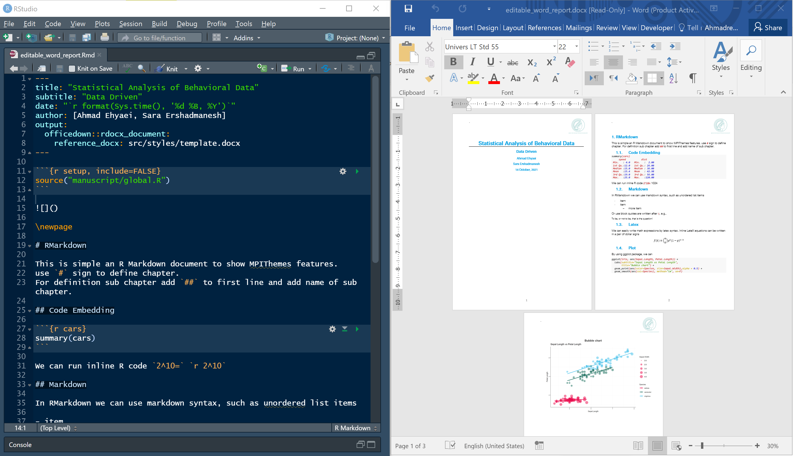

Latex or HTML documents are so beautiful, but if you want to edit some part of them, you must render all document again.
For Microsoft users, the editable Word (.docx) templage is designed. 
It uses the [officer](https://davidgohel.github.io/officer/) and 
[officedown](https://github.com/davidgohel/officedown) R packages.
The MPI template comes from template.docx, which is a word template. You can change it by setting your color or image.
To create a word template, you can find it via 
`File > New File > Rmarkdown > From Template > Editable Report (Word)`

The YAML configurations and word output can be found below.

```
---
title: "Statistical Analysis of Behavioral Data"
subtitle: "Data Driven"
date: "`r format(Sys.time(), '%d %B, %Y')`"
author: [Ahmad Ehyaei, Sara Ershadmanesh]
output: 
  officedown::rdocx_document:
    reference_docx: src/styles/template.docx
---
```

<a href="https://github.com/Ehyaei/MPIThemes/tree/master/examples/editable_word_report">

</a></td>
