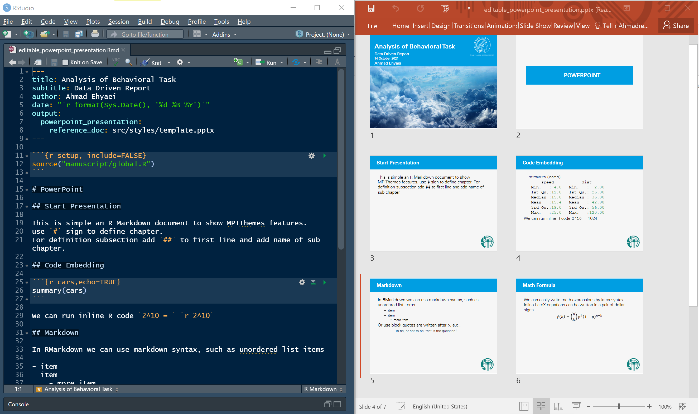

Microsoft Office PowerPoint, with its many toolbar and features, is one of the best tools for producing presentation.
In the MPIThemes package, the PowerPoint theme is designed for converting RMarkdown
to editable presentation.
The MPI custom color and logo are embedded in template.pptx, which is a PowerPoint template. You can change the color and images if you want.

To create a PowerPoint template, you can find it via 
`File > New File > Rmarkdown > From Template > Editable Presentation (PowerPoint)`

The YAML configurations and slides output can be found below.

```
---
title: Analysis of Behavioral Task
subtitle: Data Driven Report
author: Ahmad Ehyaei
date: "`r format(Sys.Date(), '%d %B %Y')`"
output: 
  powerpoint_presentation:
    reference_doc: src/styles/template.pptx
---
```

<a href="https://github.com/Ehyaei/MPIThemes/tree/master/examples/editable_powerpoint_presentation">

</a></td>
