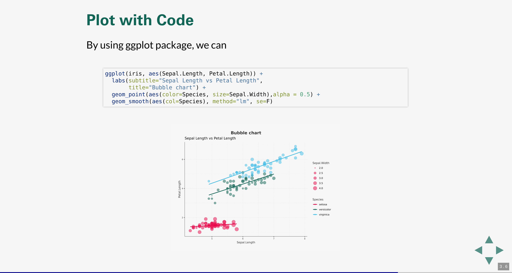
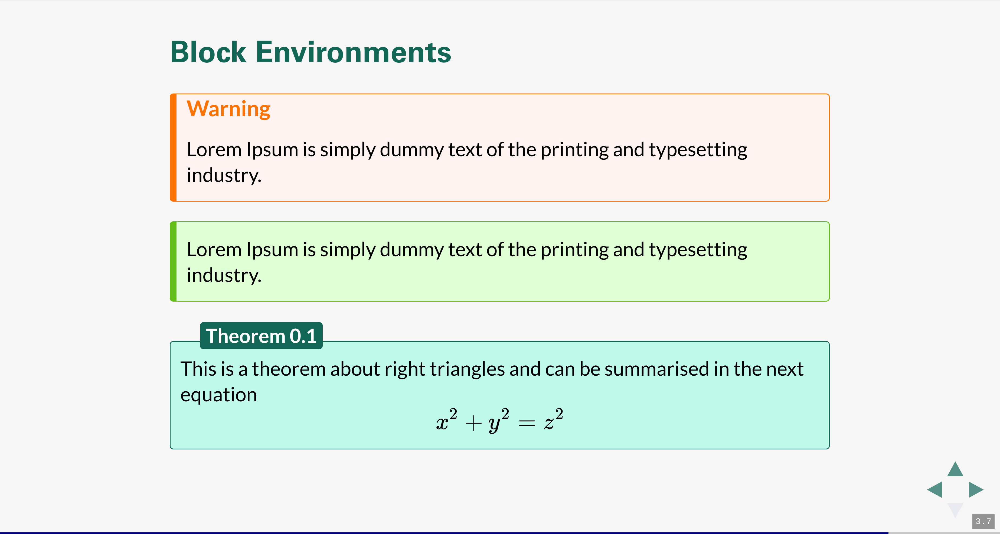

[reveal.js](https://revealjs.com/) is a creative open source HTML presentation 
framework with many awesome [plugins](https://github.com/rajgoel/reveal.js-plugins).
To create a reveal.js presentation from R Markdown we use [revealjs](https://github.com/rstudio/revealjs)
package that is developed by Rstudio team. For construct MPI Theme we add css style to
revealjs_presentation function to generate presentation. For more details you can
see revealjs [example](https://github.com/Ehyaei/MPIThemes/tree/master/examples/html_revealJS_presentation).

```
--- 
title: |
  
  Statistical Analysis of Behavioral Data
date: "`r format(Sys.time(), '%d %B, %Y')`"
author: Ahmad Ehyaei
output:
  revealjs::revealjs_presentation:
    theme: default
    css: [src/styles/template.css, src/styles/environments.css]
    transition: slide
    background_transition: default
    center: true
    reveal_options:
      slideNumber: true
      previewLinks: true
--- 
```

<table width="100%" border="0">
  <tr>
  <td>
  <a href="https://github.com/Ehyaei/MPIThemes/tree/master/examples/html_revealJS_presentation">
  
  </a></td>
  <td>
  <a href="https://github.com/Ehyaei/MPIThemes/tree/master/examples/html_revealJS_presentation">
  
  </a></td>
  <td>
  </tr>
  <tr>
  <td>
  <a href="https://github.com/Ehyaei/MPIThemes/tree/master/examples/html_revealJS_presentation">
  
  </a></td>
  <td>
  <a href="https://github.com/Ehyaei/MPIThemes/tree/master/examples/html_revealJS_presentation">
  
  </a></td>
  <td>
  </tr>
</table>


To configure a custom style, you can change `template.css` inside the path `src/styles` in the template.

You can also add the title page logo by changing the image path:

```
class="pagetitle-logo" src="src/img/MPILogoGreen.png">
```

In the YAML RMarkdown header.
