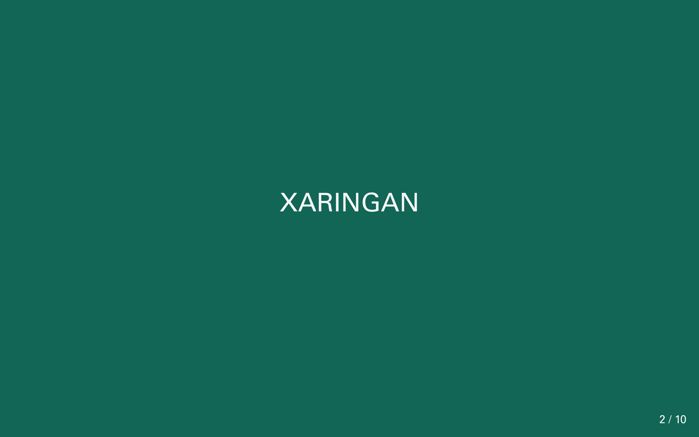
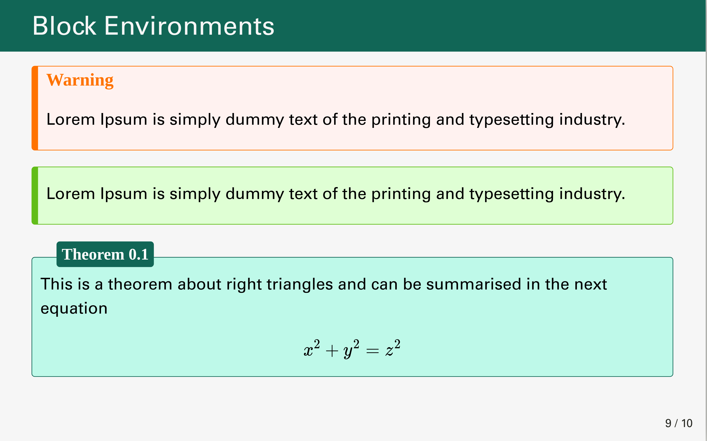

[remrak.js](https://github.com/gnab/remark) is a simple Markdown-driven presentation tool that runs in the browser.
You can create amazing presentations to fit your tastes if you have a basic understanding of HTML and CSS.
For create slides, we use [xaringan](https://github.com/yihui/xaringan) package, that has brought `remark.js` to RMarkdown. You can see [Yihui](https://slides.yihui.org/xaringan/#1) demo.
There are many introductions to Xaringan like [this](https://arm.rbind.io/slides/xaringan.html#1). 

`moon_reader` is the main function that takes many options to generate HTML slides.
To achieve the MPI theme, add custom CSS and other settings. In the below YAML, you can find theme configurations.

```
--- 
title: Statistical Analysis of Behavioral Data
subtitle: Data Driven Approach
date: "`r format(Sys.time(), '%d %B, %Y')`"
author: Ahmad Ehyaei
institute: Max-Planck Institute
output:
  xaringan::moon_reader:
    lib_dir: libs
    css: [src/styles/template.css, src/styles/environments.css]
    nature:
      highlightStyle: github
      highlightLines: true
      ratio: "16:10" 
      slideNumberFormat: "%current% / %total%"
      navigation:
        scroll: false
--- 
```

<table width="100%" border="0">
  <tr>
  <td>
  <a href="https://github.com/Ehyaei/MPIThemes/tree/master/examples/html_remamrkJS_presentation">
  
  </a></td>
  <td>
  <a href="https://github.com/Ehyaei/MPIThemes/tree/master/examples/html_remarkJS_presentation">
  
  </a></td>
  <td>
  </tr>
  <tr>
  <td>
  <a href="https://github.com/Ehyaei/MPIThemes/tree/master/examples/html_remarkJS_presentation">
  
  </a></td>
  <td>
  <a href="https://github.com/Ehyaei/MPIThemes/tree/master/examples/html_remarkJS_presentation">
  
  </a></td>
  <td>
  </tr>
</table>

There is no configuration settings than `template.css` inside the path
`src/styles` in the template. 
In the `template.css`, colors, and figures can be set on top of the code.


